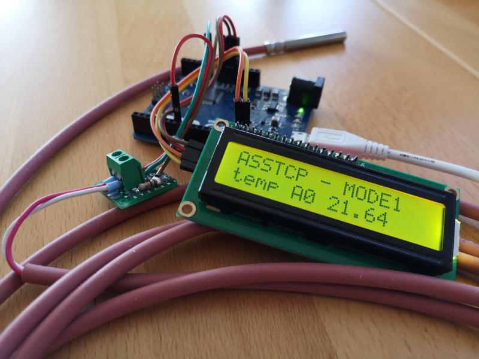

## cool Arduino Serial State Temperature Cable Probe

### Introduction
cool Arduino Serial State Temperature Cable Probe (coolASSTCP) drives Negative and Positive Temperature Coefficient (NTC & PTC) probes on all available _analog inputs_, may display those on some _I2C_ driven _LCD display_, and cycles a _state machine_ that allows for remote controlling via _serial port_; e.g. using USB.

Two projects are combined for coolASSTCP:
  - [cool Arduino serial state machine (coolASSM)](https://github.com/graetz23/coolArduinoSerialStateMachine),
  - [cool Arduino Temperature Cable Probe (coolATCP)](https://github.com/graetz23/coolArduinoTemperatureCableProbe),
and extended by _extra serial commands_ to allow for requesting wach of the six temperatures cable probes (TCPs).

### Building
For building the HEX file, the [arduino Makefile](https://github.com/sudar/Arduino-Makefile) is used. Clone or download / unzip to your system and configure the _Makefile_ to your arduino board and where you have installed _arduino Makefile_ type: _make_. Alternatively you can include all files of this project in your [arduino IDE](https://www.arduino.cc/en/main/software).

### Hardware
Wire your NTC probe with a _matching_ (same resistor value as the probe) resistor in series. Wire from the mid (between your probe and your resistor) of this _voltage divider_ to an _ananlog_ input of your arduino. Wire the _5 V_ (not system's volatage - there are two _5 V_ voltage sources) and GND to the ends of your _voltage divider_.

However there are several public _posts_, _blogs_, and _vlogs_ on internet showing a schematic wiring diagram; _try searching_ for: _NTC arduino_ or _PTC arduino_.

### Usage
See [_coolSSATCP.ino_](https://github.com/graetz23/coolArduinoSerialStateTCP/blob/master/coolASSTCP.ino) file as example and for an _own adaption_, e.g. for drving another LCD display, see the [coolASSTCP.cpp](https://github.com/graetz23/coolArduinoSerialStateTCP/blob/master/coolASSTCP.cpp) as how to.

### Remarks
I use this project for driving several NTC probess in a home brewery system to monitor the temperatures only using arduino, while the _brewery automation_ is driven by the _raspberry pi_ using  [**CraftBeerPi3**](https://github.com/Manuel83/craftbeerpi3 (CBP3)). I am currently writing a [python](https://www.python.org/) plugin for CBP3 using [coolPSSM] (https://github.com/graetz23/coolPythonSerialStateMachine) as a basis; coolPSSM is the python aquivalent to [coolASSM](https://github.com/graetz23/coolArduinoSerialStateMachine).

Everything was coded using:

  - [**atom**](https://atom.io/) editor,
  - [**arduino Makefile**](https://github.com/sudar/Arduino-Makefile),
  - [**Gnome**](https://www.gnome.org/) windows manager,
  - and [**debian**](https://www.debian.org/) GNU/Linux.

## ChangeLog

**20200402**
  - matching to coolASSM verions 20200402:
    - in _coolASSM_: method _running_ was deprecated and removed,
    - in _coolASSM_: methods _runMODE1, runMODE2, .., runMODE7_ were added instead,
    - _overloaded_ method _runMODE1_ instead of _running_
  - added signaling on built in LED (PIN 13) of several states:
    - ERROR the LED is contantly on,
    - IDLE the LED does a heartbeat with 60 bpm,
    - and for all run MODEs, the LED flashes by 10 milliseonds.
  - added photo of my _test bench_ ;-)

**20200331**
  - adding MIT License to all files.
  - adding the README.md for explanation,
  - setting up reository on [github.com](https://github.com/graetz23/coolArduinoSerialStateTCP).
